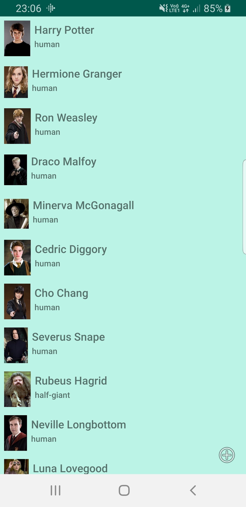
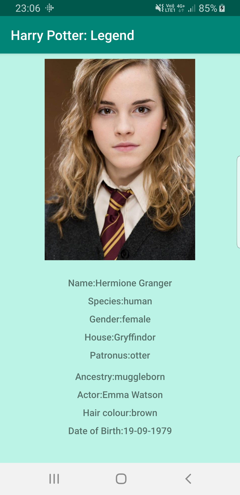

# HarryPotterLegend
Projet de développpement mobile visant à afficher une liste d'items en faisant appel à un serveur(API rest) et utilisant le modèle MVC, puis d'ouvrir un deuxième écran en cliquant sur un item de la liste du premier écran

## Prérequis:
-installation d'android studio
-récupérrer le dépot: https://github.com/GeekyGodess/HarryPotterLegend.git

## Consignes respectées:
*utilisation du MVC
*Appel à une API Rest pour récupérer de la donnée
*Gitflow
*Deux écrans : Un écran avec une liste et un écran avec un détail de l'item

## Captures d'écran

Capture d'écran de l'écran affichant la liste des personnages du monde d'Harry Potter:

Capture d'écran de l'écran affichant les détails sur un personnage (ici Hermione Granger):

Le passage de l'écran affichant la liste des personnages du monde d'Harry Potter à l'écran affichant les détails sur un personnage se fait en cliquant sur un personnage dans le premier écran.
